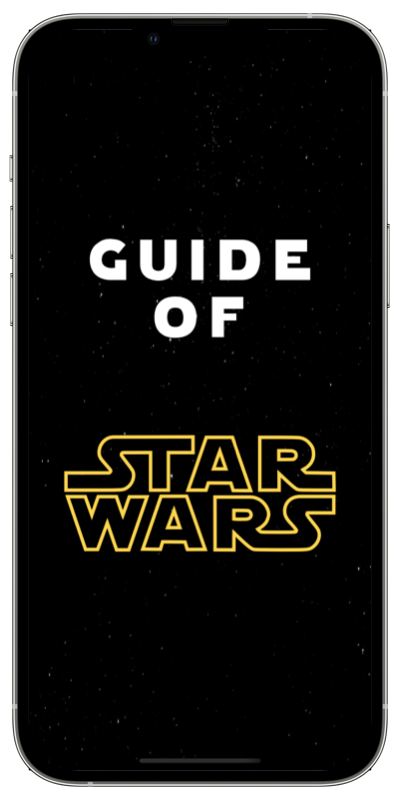
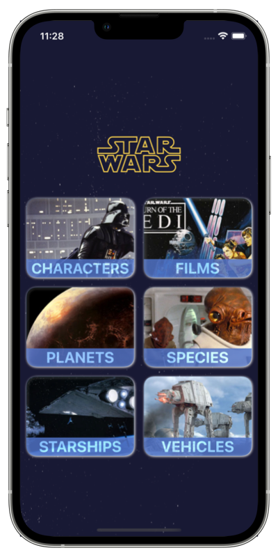
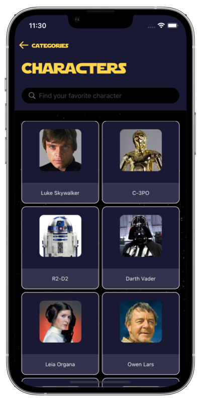
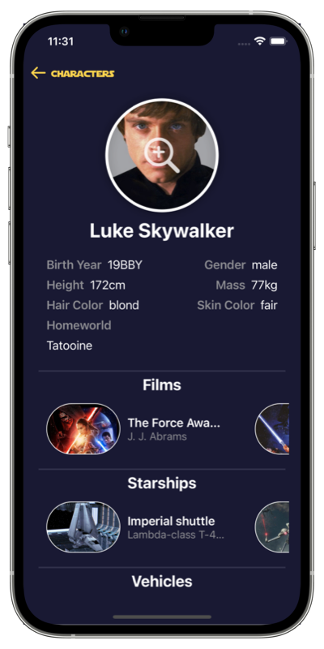

# Guide of Star Wars

This app is the 2st. monthly code challenge proposed by [@MoureDev](https://github.com/mouredev).
[App Monthly Challenge 2022](https://github.com/mouredev/Monthly-App-Challenge-2022)

Screen 1 | Screen 2 |
--- | ---
 |  |  | 

Screen 3 | Screen 4
--- | ---
 | 

## Tech stack

- This project uses the MVVM
- Xcode 13.2.1
- SwiftUI
- Swift 5.5.2
- iOS 15.2
- iPhone only supported in portait